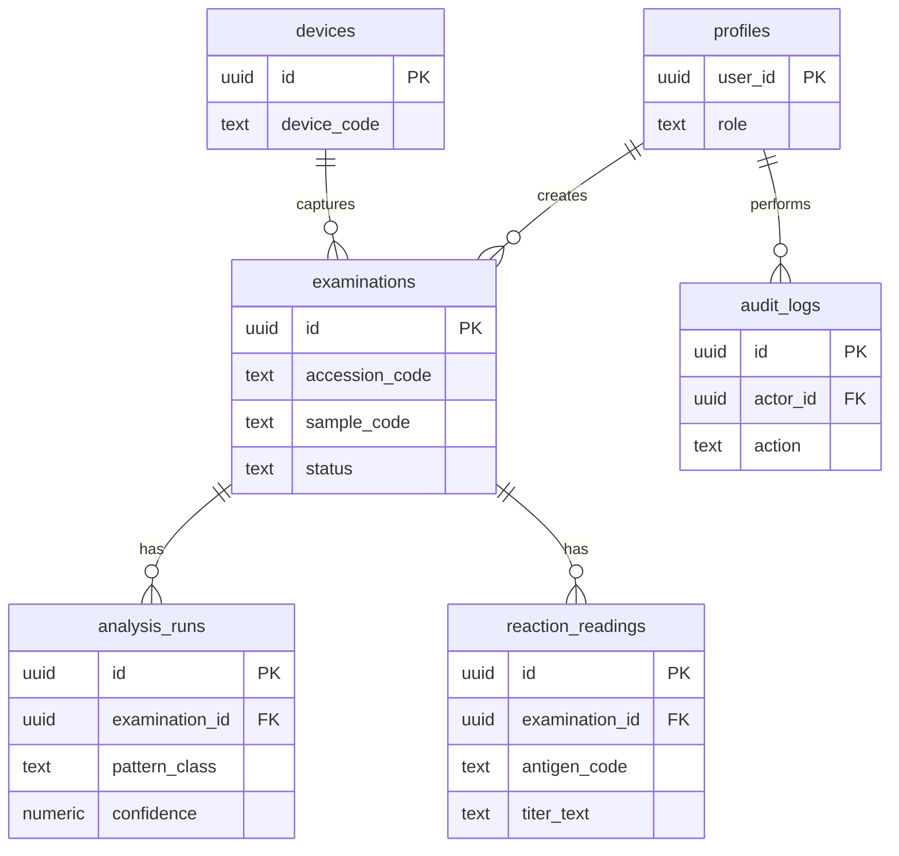

# WIDAL-SCAN AI — ERD

```mermaid
erDiagram
 profiles ||--o{ examinations : creates
 devices ||--o{ examinations : captures
 examinations ||--o{ analysis_runs : has
 examinations ||--o{ reaction_readings : has
 profiles ||--o{ audit_logs : performs
 profiles { uuid user_id PK text role }
 devices { uuid id PK text device_code }
 examinations { uuid id PK text accession_code text sample_code text status }
 analysis_runs { uuid id PK uuid examination_id FK text pattern_class numeric confidence }
 reaction_readings { uuid id PK uuid examination_id FK text antigen_code text titer_text }
 audit_logs { uuid id PK uuid actor_id FK text action }
```
